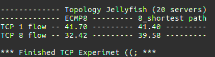

# TP1-Jellyfish 

Reprodução dos principais resultados do artigo "Jellyfish: Networking Data Centers Randomly". Esses resultados englobam a Figura 9 e Tabela 1 do artigo.

A construção da topologia Jellyfish se embasa em um grafo aleatório. Em teoria dos grafos, um grafo aleatório é obtido a partir de um conjunto de n vértices e adicionando arestas entre elas de forma aleatória. No caso da topologia Jellyfish, a construção desse grafo consiste em um conjunto de switches e servidores, onde cada servidor está conectado a um determinado switch. As conexões entre os switches são realizadas de forma aleatória. Para mais detalhes sobre a topologia Jellyfish acesse o link https://andressavergutz.wordpress.com/info7015-jellyfish/. Este link contém também a descrição deste trabalho (TP1), resultados alcançados e dificuldades encontradas.


## Reproduzindo nossos resultados

### Pré-requisitos:

Para executar os testes deste respositório você precisará instalar o Mininet em sua máquina ou criar uma máquina virtual (VM). Nós utilizamos o Mininet v2.2.2. Além disso, como a Tabela 1 do artigo apresenta resultados tanto do protocolo TCP quanto do MPTCP, foram criadas duas máquinas virtuais no VirtualBox v5.1.38:

```
1 - VM1: Ubuntu 16.04 LTS 64 bits com o TCP compilado no kernel (2GB de memória, 3 CPUs, python v2.7.6)

    - Download da VM1 está disponível no site do mininet: https://github.com/mininet/mininet/wiki/Mininet-VM-Images
    
2 - VM2: Ubuntu 16.04 LTS 64 bits com o MPTCP compilado no kernel (2GB de memória, 4 CPUs, python v2.7.6)
``` 

A Figura 9 foi gerada na VM com TCP. Enquanto os resultados da Tabela 1 foram obtidos em ambas as VMs. Foi necessário instalar algumas bibliotecas em ambas as VMs para obter os resultados requeridos. Dessa forma, execute os seguintes comandos em cada VM para instalar as bibliotecas e dependências:

```
1 - sudo apt-get install python-matplotlib python-numpy python-network
```

Além das bibliotecas do python, é necessário instalar o monitor de largura de banda (bwm-ng). Através desse monitor é possível executar o comando iperf e medir o throughput. Para isso, execute os seguintes comandos:

```
1 - cd mininet/
2 - git clone https://github.com/vgropp/bwm-ng.git
3 - cd bwm-ng/
4 - sudo sh autogen.sh
5 - sudo ./configure
6 - sudo make
7 - sudo make install
```

### Instalando nosso repositório

O artigo discutido neste TP1 foi publicado em 2012, havendo assim um espaço de tempo de 6 anos até o momento. Devido a isso, há diversos trabalhos na literatura que tentaram reproduzir os mesmos resultados do artigo (Figura 9 e Tabela 1) e disponibilizaram o código na plataforma GitHub. Dessa forma, a fim de auxiliar o desenvolvimento do trabalho foi testado vários códigos de repositórios. No geral, a maioria dos trabalhos apenas reproduz a Figura 9, se abstendo da Tabela 1. Em vista disso, utilizamos como base um projeto ([link do repositório original](https://github.com/aghalayini/CS244_jellyfish)) que gera a Figura 9 e parte da Tabela 1. Fizemos alterações nos códigos, criamos alguns scripts e testamos com diferentes números de servidores. Os principais códigos alterados foram o graph-paths.py e build_topology.py.

Para instalar nosso respositório e executar nossos testes, execute os seguintes comandos:

```
1 - git clone https://github.com/andressavergutz/TP1-Jellyfish.git
2 - cd TP1-Jellyfish/jellyfish/pox/ext/
3 - sudo chmod +x run.sh 
```

Se você estiver na **VM1 com o TCP** compilado no kernel do linux, execute:

```
4 - sudo ./run.sh --tcp  
```

- Esse comando gera a Figura 9 (figure9.svg), um grafo da topologia da rede (network-graph.svg) e a Tabela 1 (parte do TCP).
- Para gerar a Tabela 1 esse script irá executar os 4 cenários referentes ao protocolo TCP (1fluxo_ECMP, 8fluxos_ECMP, 1fluxo_8shortest e 8fluxos_8shortest). Nos cenários utilizamos 20 servidores, mas você pode alterar os scripts para alterar esse parâmetro. Além disso, irá executar 3 vezes cada cenário para obter o througput médio final. Quando o script terminar de executar todo o cenário, ele apresentará a Tabela 1 no terminal bash. 


Se você estiver na **VM2 com o MPTCP** compilado no kernel do linux, execute:

```
5 - sudo ./run.sh --mptcp  
```
- Esse comando gera a Figura 9 (figure9.svg), um grafo da topologia da rede (network-graph.svg) e a Tabela 1 (parte do MPTCP).
- Para gerar a Tabela 1 esse script irá executar os 2 cenários referentes ao protocolo MPTCP (8fluxos_ECMP e 8fluxos_8shortest). Nos cenários utilizamos 20 servidores, mas você pode alterar os scripts para alterar esse parâmetro. Além disso, irá executar 3 vezes cada cenário para obter o througput médio final. Quando o script terminar de executar todo o cenário, ele apresentará a Tabela 1 no terminal bash.


Obs.: A única restrição é que os resultados são apenas para a topologia Jellyfish. O Fat-tree não conseguimos implementar.


